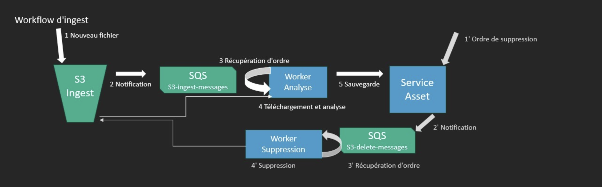

# TP WORKFLOW MEDIA INGEST

## I Introduction

Dans ce TP nous allons créer un **Workflow d'ingest** des medias wav. 

Il permet d'analyser des media reçus sur un bucket S3, de les valider et les indexer.

- Les fichiers sont reçus sur un bucket S3.

- A la reception d'un fichier, le bucket S3 envoie un évenement sur une file SQS.

- Un worker d'analayse écoute cette file SQS. Lorsqu'un nouvel évenement arrive, il exécute une tache d'analyse et sauvegarde le résultat auprès du service asset si le media est valide, sinon il le supprime.

- Un service d'assets HTTP présente l'API pour gérer ces ressources.

- Le service d'assets peut supprimer des ressources et ordonner la suppression d'un fichier sur le bucket S3.



S3 et SQS sont des services managés qui seront simulés en local grâce à LocalStack un service exécuté sur Docker.

## II Installation

L'environnement de travail a déjà des outils installés :

- Python3
- Pip (Python package manager)
- Docker
- Git

**[virtualenv](https://virtualenv.pypa.io/en/latest/)**

Virtualenv (venv) permet de configurer des environnements Python isolés. Créez un virtualenv et installez les dépendances Python du projet:

```shell
    python3 -m venv .venv 
    source .venv/bin/activate && pip install --upgrade pip && pip install -r requirements.txt 
```

 Le code de ce projet sera exécuter dans le virutalenv pour résoudre les dépendances Python. Dans tous nouveaux shell, vous pouvez activer le virualenv avec :

    source .venv/bin/activate

Le prompteur commence par (.venv) quand le virtualenv est activé.

**[LocalStack](https://github.com/LocalStack/LocalStack)**  

_LocalStack est disponible dans le virtualenv._

Lancez la commande : 

```shell
    sudo su - #fix-codespace
    source .venv/bin/activate
    localstack start -d
```
_Le service peut mettre un certain temps à démarrer car il doit télécharger l'image docker de LocalStack._

Vérifiez l’état des services LocalStack :

    source .venv/bin/activate
    localstack status services

**[AWS CLI](https://awscli.amazonaws.com/v2/documentation/api/latest/index.html)**

 _AWS CLI est disponible dans le virtualenv._

Cet utilitaire permet d'interagir avec des ressources disponibles sur AWS commes les services managés. Dans ce TP _AWS CLI_ interagit avec les ressources de LocalStack.

Ajoutez ces variables dans un script bash `env.sh` pour configurer _AWS CLI_ avec LocalStack.

```shell
    export AWS_ACCESS_KEY_ID="test"
    export AWS_SECRET_ACCESS_KEY="test"
    export AWS_DEFAULT_REGION="us-east-1"
    alias awslocal='aws --endpoint-url=http://localhost:4566'
``` 
__Il faut remplacer la commande `aws` par `awslocal` dans la suite du TP__

Pour charger ces valeurs, utilisez la commande :

```shell
    source env.sh
```

**Références et documnetations**

L'interface de la ligne de commande [AWS CLI](https://awscli.amazonaws.com/v2/documentation/api/latest/index.html)

AWS SDK Python [BOTO3](https://boto3.amazonaws.com/v1/documentation/api/latest/index.html)

Le framework Python [FastAPI](https://fastapi.tiangolo.com/)

La bibliothéque HTTP [requests](https://www.w3schools.com/python/module_requests.asp)

La bibliothéque d'analyse de wav [wavinfo](https://wavinfo.readthedocs.io/en/latest/command_line.html)

Le modélè de données de wavinfo :
```python
{
  "fmt": {
    "audio_format": 1,
    "channel_count": 2,
    "sample_rate": 48000,
    "byte_rate": 288000,
    "block_align": 6,
    "bits_per_sample": 24
  },
  "data": {
    "byte_count": 1441434,
    "frame_count": 240239
  }
}
```

## III Les services managés AWS

**Référez-vous à la documentation AWS CLI**

**S3**

S3 (Simple Stockage Service) stocke les fichiers sous forme d'objets dans un compartiment appelé bucket.

**Complétez la ligne de commande et créez un nouveau bucket S3 nommé `ingest`:**

```shell
awslocal s3api ...
```

**Que retourne l'API ?** 

**Reportez les commandes AWS S3 pour:** 

    - Ajouter un fichier
    - Listez des fichiers
    - Supprimer un fichier

Des échantillons sont disponibles dans le dossier media/audio_(1-5).wav. Déposez les dans le bucket ingest.

**SQS**

SQS est un service d'échange de messages.

**Complétez la ligne de commande et créez une nouvelle file SQS nommée `s3-ingest-messages` avec les attributs `file://configs/sqs-retention-config.json`:**

```shell
awslocal sqs create-queue ...
``` 

**Quel est le retour de cette commande ?** 

Il faut configurer le bucket pour qu’il notifie la présence d’un nouveau fichier par cette file SQS.

**Complétez la ligne de commande et appliquez la configuration sur le bucket S3 `ingest` avec la configuration `file://configs/s3-notif-config.json`:**

```shell
awslocal s3api put-bucket-notification-configuration ... 
```

## IV Workflow d'Ingest

**Configuration**

Créez le fichier `code/settings.py` et complétez les valeurs manquantes en avancant dans le TP.

```python
STACK_URL = "http://localhost:4566"
ASSET_URL = "http://localhost:8000"
SQS_INGEST = ""
SQS_DELETE = ""
``` 

**Backend API assets**

Le service HTTP assets `code/http_assets.py` présente l'API REST des ressources assets. Ce service utilise le framework Python FastAPI et génére une documentation automatiquement.

Exécutez la commande pour lancer le serveur :

```shell
uvicorn code.http_assets:app --reload
``` 

Accédez à l'API REST http://localhost:8000 dans un navigateur web.

**Quelles sont les routes proposées par l'API du service ?**

**Analisez le code source du services `code/http_assets.py`. Que faudrait il ajouter pour améliorer le fonctionnement de ce microservice ?**

**Workflow d'analyse**

Le worker d'analayse `code/worker_probe.py` détecte un message SQS sur la file `s3-ingest-messages`. Il télécharge le fichier, l'analyse et envoie le résultat au service HTTP assets par API.

Modifiez le worker :

1/ Le worker télécharge depuis S3 le media à analyser (PART IV A).

2/ Ajoutez des règles de gestion dans l'analyse (PART IV B):

- Un fichier doit avoir une fréquence d'échantillonnage de `48000` hz et une quantification de `24` bits pour être valide.

3/ Le worker analyse le wav et retourne un dictionnaire. Commpletez ce dictionnaire avec des informations issues du modélè de données de wavinfo (PART IV C):

    - channel_count: int
    - frame_count: int
    - sample_rate: int
    - bits_per_sample: int
    - duration: str (calculée à partir du frame_count et du sample_rate)

4/ Cette analyse est envoyée au service HTTP assets par API (PART IV D).

5/ Si l'analyse du fichier est invalide, le ficher est supprimé du bucket S3. Implémetez la suppression de fichier dans le bucket S3. (PART IV E)

Exécutez la commande pour lancer le worker :

```shell
python code/worker_probe.py 
``` 

Ajoutez tous les fichiers du répertoire `media` dans le bucket `s3://ingest/` pour déclencher des workflows.

**Listez les fichiers valides sur le bucket `ingest` avec une commande awslocal s3.**

**Récuperez sur l'API du service HTTP assets toutes les analyses enregistrées.**

**Quels fichiers sont invalides et pourquoi sont-ils invalides ?**

**Workflow de suppression de fichiers**

Créez une file SQS `s3-delete-messages` et completer le fichier settings.py avec la valeur de `SQS_DELETE`.

**Complétez la ligne de commande et créez une nouvelle file SQS nommée `s3-delete-messages` avec les attributs `file://configs/sqs-retention-config.json`:**

```shell
awslocal sqs create-queue ...
```

Completez le code du service HTTP assets `code/http_assets.py` pour envoyer un message de suppressions sur la route `DELETE` (PART IV F).

Completez le code du worker de suppression de fichier `code/worker_delete.py` (PART IV G).

(Utilisez la fonction `commons.dict_tojson` pour serialiser le MessageBody de sqs.send_messsage().)

Le message JSON d'initialisation de la suppression est de cette forme :

```json
    {
        "file": {
            "bucket": "",
            "key": "",
        }
    }
```

Ou bucket contient le nom du bucket S3; key contient le nom du fichier.

Exécutez la commande pour lancer le worker de suppression :

```shell
python code/worker_delete.py 
```

Supprimez un des assets enregistrés par un appel sur l'API du service assets.

**Quelle route est utilisée pour supprimer un asset sur le service HTTP ? Reportez les logs du worker et du service lors d'un suppression.**
